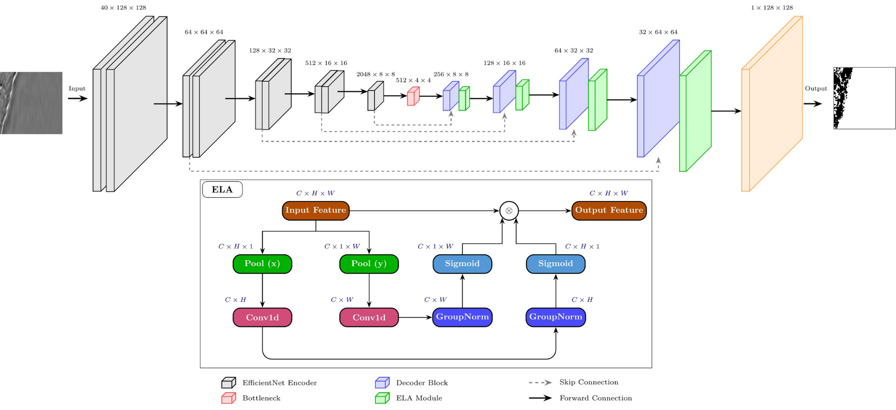
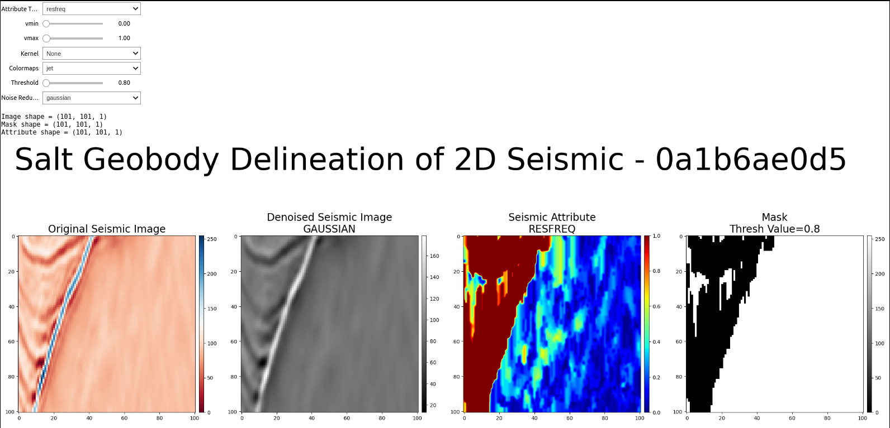

<h2>Attention-based Neural Network for Deep Salt Segmentation from Weakly Annotated Seismic Data (Submitted to Computers & Geosciences)</h2>

<h4>By: Joshua Atolagbe & Ardiansyah Koeshidayatullah (College of Petroleum & Geosciences, King Fahd University of Petroleum & Minerals)</h1>

## Architecture




## Requirements
Install requirements
```shell
pip install -r requirements.txt
```
+ +NVIDIA GPU + CUDA CuDNN
+ +Linux (Ubuntu)
+ +Python v3.10

## Creating Weak labels with SASApp
Check the `SAS app` to see how to create weak labels through seismic attributes segmentation


## How to train SASNet
Open terminal and run:
```shell
python train.py \
    --model_save_dir models \
    --batch_size 16 \
    --num_epochs 30 \
    --learning_rate 1e-4 \
    --model unet_effnet_skip_ela \
    --learning_type weak
```

## Citation
```text
@ARTICLE{10909446,
  author={Atolagbe, Joshua and Koeshidayatullah, Ardiansyah},
  journal={Computers & Geosciences}, 
  title={Attention-based Neural Network for Deep Salt Segmentation from Weakly Annotated Seismic Data}, 
  year={2025},
  volume={},
  number={},
  pages={},
  doi={}
}

```

## Credit

We adapted the seismic attributes extraction codes from [d2geo](https://github.com/dudley-fitzgerald/d2geo) github repo.